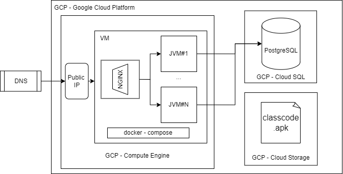

<div align="center" style="margin-bottom: 30px">
    <div style="margin-bottom: 30px; margin-top: 30px" >
        
    </div>
    <a href="../../graphs/contributors">
        
        </a>
    <a href="../../stargazers">
        
    </a>
    <a href="../../issues">
        
    </a>
    <a href="../../pulls">
        
    </a>
</div>


## Overview


The i-on ClassCode provides a system for creating and managing GitHub repositories in an academic context,
providing a set of tools for both students and teachers,
in order to improve efficacy and convenience.

The i-on initiative aims in systems open source software for academic purposes.

## Table of Contents

- [Overview](#overview)
- [Repository Organization](#repository-organization)
- [Functionalities](#functionalities)
- [Deployment](#deployment)
- [Installation](#installation)
    - [Web and JVM Application](#web-and-jvm-application)
    - [Mobile Application](#mobile-application)
- [License](#license)
- [Project Status](#project-status)

## Repository Organization

The repository is organized as follows:

- [code/](code) : Source code to all the components of the project
- [docs/](docs) : Project documentation, namely images, diagrams and reports.

## Functionalities

- [ ] Associate a GitHub repository to a Course
- [ ] Create Classrooms, included in a Course
- [ ] Invite Codes to Students to join a Classroom
- [ ] Create Assignments, included in a Classroom
- [ ] Create Teams associated with an Assignment
- [ ] Create a GitHub repository and a GitHub Team for each Assignment Team
- [ ] Define a set o rules for the teams
- [ ] Define various Deliveries for an Assignment, with tag control and deadline
- [ ] Check for each Delivery, the Teams that have delivered and the ones that have not
- [ ] Post feedback to the Teams, based on labels
- [ ] Accept other GitHub users to join as Teachers

## Installation


### Web and JVM Application

To install and set up the i-on ClassCode system, follow the steps below:

1. Clone the repository:

```bash
git clone https://github.com/i-on-project/repohouse.git
```

2. Set up the environment variables:
   - check the [jvm](./code/jvm/README.md#environment-variables) README for more information.
   - check the [js](./code/js/README.md#environment-variables) README for more information.


3. Set up the database:
   - ensure that the database is running, with the tables and triggers created.
   - check the [sql](./code/sql) directory for the database scripts.

4. Run the backend server:

```
cd code/jvm
./gradlew bootRun
```

5. Install the frontend dependencies:

```
cd code/js
npm install
```

6. Run the frontend server:

```
npm start
```


7. You're all set! The i-on ClassCode system is now installed and ready to use.

Note: Make sure you have Node.js and npm installed on your machine before proceeding with the installation.

:warning: Warning: While in development, the frontend server will run on port 3000 using Ngrok. This is done to allow the mobile application to access the backend server. 


Enjoy using i-on ClassCode to enhance your academic repository management experience!

### Mobile Application

To install and set up the i-on ClassCode mobile application, follow the steps below:

1. Clone the repository:

```
git clone
```

2. Set up the environment variables:
   - check the [android](./code/android/README.md#environment-variables) README for more information.

3. Install the application on your device:

```
./gradlew installDebug
```

You're all set! The i-on ClassCode mobile application is now installed and ready to use.

Note: Make sure you have the Android SDK installed on your machine before proceeding with the installation and the Web and JVM Application running.

## Deployment

The deployment of the i-on ClassCode system is done using GCP (Google Cloud Platform) and Docker.



Using the GCP Compute Engine, a virtual machine is created, to which the Docker Compose file is deployed.
The Docker Compose file contains the images of the i-on ClassCode system, namely the frontend and n instances of the backend server.
In order to access the system, the GCP Firewall is configured to allow access to the ports 80 and 443, and the definition of a static IP address is done.

The database is deployed using the GCP Cloud SQL, which is a managed database service for PostgreSQL. The database is configured to allow access from the GCP Compute Engine.

There was a definition of a domain name (i-on.live), which is associated with the static IP address of the GCP Compute Engine, and a SSL certificate was created using the [Name.com](https://www.name.com/) service.

The deployment of the mobile application is done using the apk file generated by the Android Studio, and the installation of the application is done using the blob storage of the GCP Cloud Storage.

:warning: Warning: Due to the fact of being a student project, the deployment of the i-on ClassCode system may not be available at all times, due to the fact that the GCP credits are limited.

## License

This project is licensed under the Apache License 2.0 — see the [LICENSE](LICENSE) file for details.


## Project Status

This project is currently released in [classcode.i-on.live](https://classcode.i-on.live/).


