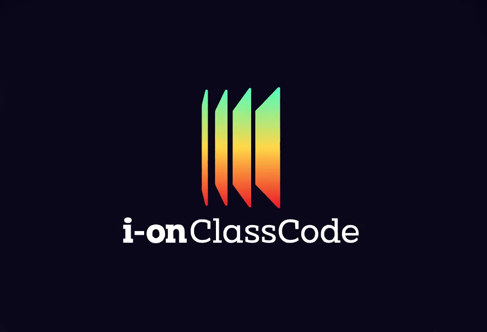

<div align="center" style="margin-bottom: 30px">
    <div style="margin-bottom: 30px; margin-top: 30px" >
        
    </div>
    <a href="../../graphs/contributors">
        
        </a>
    <a href="../../stargazers">
        
    </a>
    <a href="../../issues">
        
    </a>
    <a href="../../pulls">
        
    </a>
</div>


## Overview


The i-on ClassCode provides a system for creating and managing GitHub repositories in an academic context,
providing a set of tools for both students and teachers,
in order to improve efficacy and convenience.

The i-on initiative aims in systems open source software for academic purposes.

## Table of Contents

- [Overview](#overview)
- [Functionalities](#functionalities)
- [Repository Organization](#repository-organization)
- [Installation](#installation)
    - [Web and JVM Application](#web-and-jvm-application)
    - [Mobile Application](#mobile-application)
- [License](#license)
- [Project Status](#project-status)


## Functionalities

- [ ] Associate a GitHub repository to a Course
- [ ] Create Classrooms, included in a Course
- [ ] Invite Codes to Students to join a Classroom
- [ ] Create Assignments, included in a Classroom
- [ ] Create Teams associated with an Assignment
- [ ] Create a GitHub repository and a GitHub Team for each Assignment Team
- [ ] Define a set o rules for the teams
- [ ] Define various Deliveries for an Assignment, with tag control and deadline
- [ ] Check for each Delivery, the Teams that have delivered and the ones that have not
- [ ] Post feedback to the Teams, based on labels 
- [ ] Accept other GitHub users to join as Teachers
 
## Repository Organization

The repository is organized as follows:

- [code/](code) : Source code to all the components of the project
- [docs/](docs) : Project documentation, namely images, diagrams and reports.

## Installation


### Web and JVM Application

To install and set up the i-on ClassCode system, follow the steps below:

1. Clone the repository:

```bash
git clone https://github.com/i-on-project/repohouse.git
```

2. Set up the environment variables:
   - check the [jvm](./code/jvm/README.md#environment-variables) README for more information.
   - check the [js](./code/js/README.md#environment-variables) README for more information.


3. Set up the database:
   - ensure that the database is running, with the tables and triggers created.
   - check the [sql](./code/sql) directory for the database scripts.

4. Run the backend server:

```
cd code\jvm
./gradlew bootRun
```

5. Install the frontend dependencies:

```
cd code\js
npm install
```

6. Run the frontend server:

```
npm start
```


7. You're all set! The i-on ClassCode system is now installed and ready to use.

Note: Make sure you have Node.js and npm installed on your machine before proceeding with the installation.

Enjoy using i-on ClassCode to enhance your academic repository management experience!

### Mobile Application

- [ ] TODO


## License

This project is licensed under the Apache License 2.0 — see the [LICENSE](LICENSE) file for details.


## Project Status

This project is currently in development.


