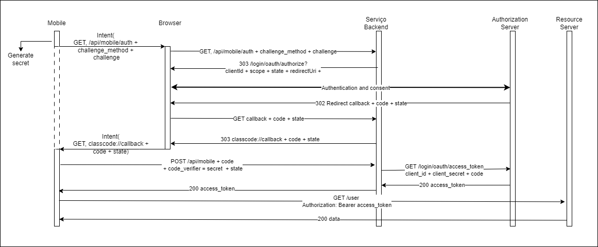

## JVM

The application is a REST API that allows all the operations of the project.

It is a Spring Boot application written in Kotlin that uses a PostgreSQL database.

The application uses the [GitHub API](#github)
to get the user's repositories and organizations and the [SendGrid API](#sendgrid) to send emails.

There is more detailed documentation about all the endpoints in [here](../../docs/api-routes.md).

### Table of contents

- [Technologies](#technologies)
- [Architecture](#architecture)
  - [Handlers](#handlers)
      - [Pipeline](#pipeline)
      - [Siren](#siren)
  - [Services](#services)
  - [Repository](#repository)
- [Authentication](#authentication)
  - [Cookies](#cookies)
- [External APIs](#external-apis)
  - [GitHub](#github)
  - [SendGrid](#sendgrid)
- [Environment variables](#environment-variables)
- [How to..](#how-to)
  - [Build](#build)
  - [Run](#run)
  - [Test](#test)
- [Docker](#docker)
- [Nginx](#nginx)


### Technologies

- [Java 17](https://www.oracle.com/java/technologies/downloads/#java17)
- [Kotlin 1.5](https://kotlinlang.org/)
- [Spring Boot](https://spring.io/projects/spring-boot)
- [Gradle](https://gradle.org/)
- [PostgreSQL 15](https://www.postgresql.org/download/)
- [Docker](https://www.docker.com/)
- [GitHub API](https://docs.github.com/en/rest)
- [SendGrid API](https://sendgrid.com/docs/api-reference/)
- [JUnit 5](https://junit.org/junit5/docs/current/user-guide/)
- [Mockito](https://site.mockito.org/)
- [Nginx](https://www.nginx.com/)


### Architecture

The application is divided in three layers: handlers, services and repository.

The [handler](#handlers) layer is the one that receives the requests and sends the responses.
It is the layer that is exposed to the outside world.

The [services](#services) layer is the one that contains the business logic of the application. 
It is the layer that contains the application's rules.

The [repository](#repository) layer is the one that contains the database access logic. 
It is the layer that contains the queries to the database.


#### Handlers

The handlers are the ones that receive the requests and send the responses.
They're the ones that are exposed to the outside world and the only piece of code that is aware of the HTTP protocol.

The handlers are separated in two packages, one for the handlers 
that are used in controllers for the Web API and another for the handlers 
that are used in the controllers for the Mobile Application.

The handlers are the ones that are responsible for the authentication of the user,
and for the authorization of the user to access the resources, using the [pipeline](#pipeline) for it.

The responses sent by the handlers are always in hypermedia format,
using the [Siren](https://github.com/kevinswiber/siren) format.

##### Pipeline

They're two possible ways of adding code to be executed before and after the handler execution:

- `Handler Interceptors`: This is a Spring Boot interface that allows to add code to be executed before and after the handler execution.
- `Servlet Filters`: Are a mechanism defined by the [Java Servlet API](https://javaee.github.io/servlet-spec/) and allow for code to be executed before and after the servlet is called.

The user authentication and authorization are done using the `Handler Interceptor`, 
where is verified if the cookie received in the request is present and then with an `Argument Resolver`
is verified if the user is present in the database and if the user has the necessary permissions to access the resource.

With the `Servlet Filter`, is created a logger that logs the requests and responses,
for all the requests made to the application.

##### Siren

The Siren format is a hypermedia format that allows to add metadata to the responses,
that can be used to navigate through the API.

> "Siren is a hypermedia specification for representing entities. 
> As HTML is used for visually representing documents on a Web site, 
> Siren is a specification for presenting entities via a Web API. 
> Siren offers structures to communicate information about entities, 
> actions for executing state transitions, and links for client navigation."
> 
> `Siren - Specification`

The Siren format is composed by the following fields:

- `class`: The class of the entity. It can be a single class or a list of classes.
- `properties`: The properties of the entity.
- `entities`:An Entity is a URI-addressable resource that has properties and actions associated with it. It may contain sub-entities and navigational links.
  - `class`: Describes the nature of an entity's content based on the current representation.
  - `rel`: Defines the relationship of the sub-entity to its parent.
  - `href`: The URI of the linked sub-entity.
- `actions`: The actions that can be performed on the entity.
  - `name`: Identifies the action to be performed.
  - `method`: The HTTP method of the action.
  - `href`: The URI of the action.
  - `title`: Descriptive text about the action.
  - `type`: The encoding type for the request.
  - `fields`: Fields represent controls inside actions.
    - `type`: The input type of the field.
    - `value`: A value assigned to the field.
    - `title`: Textual annotation of a field.
- `links`: Represent navigational transitions.
  - `rel`: The relation of the link to its entity.
  - `href`: The URI of the linked resource.
  - `type`: Defines media type of the linked resource, per [Web Linking (RFC5988)](https://tools.ietf.org/html/rfc5988).
  - `title`: Text describing the nature of a link.


The media type of the responses is `application/vnd.siren+json`.

#### Services

The services are the ones that contain the business logic of the application.

The services make a bridge between the handlers and the repository, 
where the handlers call the services, verifying if the content of the request is valid,
and the services call the repository, to get the data from the database, to check the request data and to make then requests to the repository for the data to be saved.

The services mostly return the data in the format that is received from the repository.

Also, the services make the calls to the external APIs, to complement the functionality of the application.

- In the case of the GitHub API, to get the organization, repositories and information of the user.
- For the SendGrid API, to send the emails with the verification link to the users.

#### Repository

The repository is the piece that makes the interaction to the database.

The repository is the one that contains the atomic operations to the database.

All the operations are done with a transaction that is created for the relation 1:1 per request,
even if there are multiple operations to the database.

### Authentication

Some documentation
made about the authentication ways 
with GitHub can be found [here](../../docs/github-access-control.md).


Although 
the application uses the [GitHub OAuth](https://docs.github.com/en/developers/apps/authorizing-oauth-apps)
to authenticate the users,
the process of authentication is done in two ways,
one for the Web API and another for the Mobile Application.

#### Web API

The process is initiated by the user in the client, sending a request to the server,
that receives a redirect to the GitHub OAuth page,
where the user must authenticate himself, with the scope and client id that was sent in the request.

After the user authenticates himself, the GitHub OAuth page redirects the user to the server,
with a code that is used to get the access token of the user, and the scope that was requested for verification.

With the code, the i-on ClassCode server makes a request to the GitHub API, to get the access token of the user,
and with the access token, the server makes a request to the GitHub API, to get the user information.


#### Mobile Application

The process of authentication for the mobile application uses one stack of security called PKCE, 
it's possible to see more about it [here](https://pfelix.wordpress.com/2016/02/15/oauth-2-0-and-pkce/),
a document created by the professor in charge of this project.

The process is initiated by the user in the mobile application, sending a request to the browser that falls back to the server,
with the client public key, that is used to encrypt the access token of the user and send the hash of the secret.
 
The process is then the same as the Web API, where the user is redirected to the GitHub OAuth page,
where the user must authenticate himself, with the scope and client id that was sent in the request.

After the user authenticates himself, sends the code to the server plus the secret; that was used sent with the hash.
The server makes the verification of the secret, and if it is valid, encrypts the access token with the client public key, that was sent in the first request.

With that, the client can decrypt the access token and use it to make requests to the server, storing the access token in the local storage.




#### Cookies

The cookies are used to be able to send information to the web client, providing a way to store information in the client.

The cookies used in the application are:

- `Session` : The user session is stored in a cookie, that is created when the user authenticates himself in the application, encrypted.
- `Position` : Information about the user, if is a Student or a Teacher.
- `userState` : State code generated for the user, to verify it during the authentication process.
- `userGithubId` : GitHub ID of the user, helps through the registration process, encrypted.

### External APIs

The JVM application uses two external APIs, to complement the application's functionality,
one to complete the purpose of the application and the other to add security to the registration process.

#### GitHub


> This requires creating an OAuth App in GitHub, that can be created [here](https://github.com/settings/developers).\
> After creating the OAuth App, the Client ID and the Client Secret must be obtained.

#### SendGrid

The JVM application uses the [SendGrid API](https://sendgrid.com/docs/api-reference/) to send emails.

This API is used to send the email with the verification link to the user, that tries to register in the application as an Student, with that, and to be ensure
of the authenticity of the email; the user must give his School Identification Number (SIN) and the email must be the same as the one in the school database.

The API is then used to send an email with an OTP (One Time Password) to the user,
that tries to register in the application.

> This requires having a key from the SendGrid API that can be obtained [here](https://app.sendgrid.com/settings/api_keys).

### Environment variables

The JVM application uses the following environment variables:

| Name                         | Description                                                                           |
|------------------------------|---------------------------------------------------------------------------------------|
| `CLASSCODE_ENCRYPTION_KEY`   | The key used to encrypt the cookies data                                              |                                     
| `JDBC_DATABASE_URL`          | The URL of the database                                                               |
| `GITHUB_CLIENT_ID`           | The client ID of the GitHub OAuth App                                                 |                               
| `GITHUB_CLIENT_SECRET`       | The client secret of the GitHub OAuth App                                             |                           
| `SENDGRID_CLASSCODE_API_KEY` | The key to access the SendGrid API                                                    |
| `NGROK_URI`                  | Used to allow the mobile application to access the backend server during development. | 


### How to..

#### Build

To build the JVM application, run the following command:

```
./gradlew build
```

#### Run

To run the JVM application, run the following command:

```
./gradlew bootRun
```

#### Test

To test the JVM application, run the following command:

Make sure the database is running before running the tests.
Before running the tests, verify if the database is empty and run the script [insert.sql](../sql/insert.sql) file.

```
./gradlew test
```

### Docker

The JVM application can use Docker to run the application.

All the services defined and used to run the application with Docker are in the [Compose](../jvm/docker-compose.yml) file.

The 'Compose' file creates:

- n instances of the JVM application with spring
- 1 instance of the PostgreSQL database
- 1 instance of NGINX to serve the I-on Classcode Web Application and make use of the multiple instances of the JVM application for load balancing

To run the application with Docker, run the following command:

```
./gradlew composeUp
```

To stop the application with Docker, run the following command:

```
./gradlew composeDown
```

To run the application with Docker and define the number of JVM application instances for load balancing, run the following command:

```
docker-compose up --build --scale spring-service=[number]
```

### NGINX

The JVM application uses NGINX to redirect the requests to the JVM application, use the multiple instances of the JVM application for load balancing and serve the web application.

NGINX is a high-performance web server and reverse proxy server.
It can serve static content, balance the load across multiple servers, and handle SSL/TLS encryption.

With its efficient architecture and extensive feature set, NGINX is widely used for websites, applications, and APIs to achieve scalability and improved performance.

The NGINX configuration file is in the [nginx.conf](../jvm/docker/nginx/nginx.conf) file.

