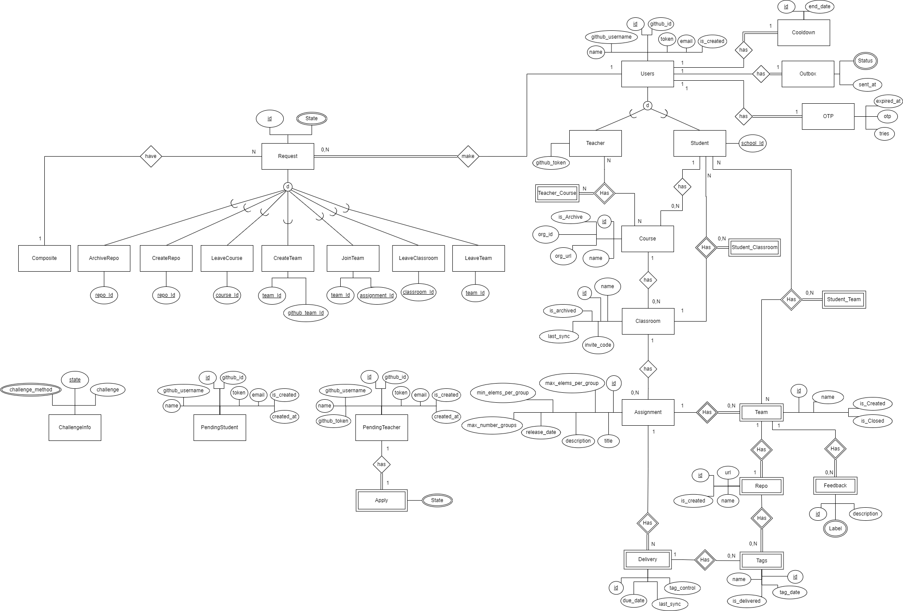

## Database

This outlines the structure and usage of the database that we use to store and manage all the data for our application.

A database is a crucial component of any modern application,
as it allows us to store, manage, and manipulate large amounts of data in a structured manner.
In our case, we are using a relational database management system (RDBMS) to store our data.
Specifically, we have chosen PostgreSQL, more specific version 15, as our database server,
as it provides a reliable, scalable, and efficient solution for our needs.

The purpose of this document is to provide an overview of the database.

### Data model

The data model is represented in the following diagram:

All the tables can be founded described in the documentation of the [data-model.md](../../docs/data-model/data-model.md) file.

### Database creation

The database can be created using the [createTables](createTables.sql) script.

The script when executed creates all the tables and the necessary constraints.

### Database population

The database can be populated using the [insert](insert.sql) script.

The script when executed inserts all the necessary data to the database, namely:

- Users
- Courses
- Classrooms
- Assignments
- Teams
- Deliveries
- Repositories
- ...

### Database deletion

The database is deleted using the [dropTables](dropTables.sql) script.

But instead of deleting the tables, the script deletes the database, so it is necessary to create the database again.

If you want to delete the tables, you can use the [deleteTables](deleteTables.sql) script.

### Database triggers

The database triggers are defined in the [triggers](triggers.sql) script.

The script when executed creates all the necessary triggers to the database, namely:

- UpdateApplyRequests — Creates a teacher after an 'Apply' request is accepted
- DeleteTeachers — Deletes all information related to a teacher when the teacher is deleted
- SyncClassroom — Syncs the classroom information after a delivery in it is updated

