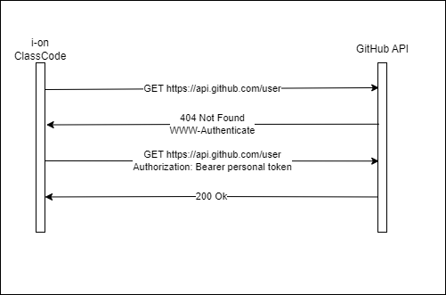
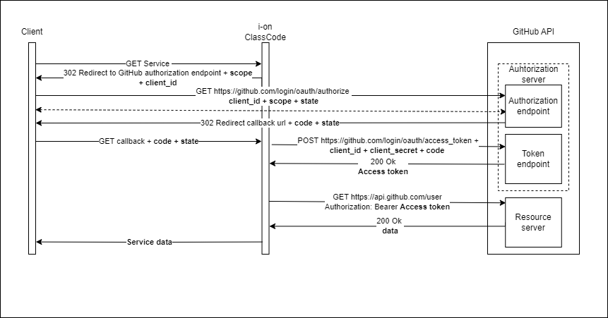

# GitHub Access Control

> To ensure the security and privacy of user data, the GitHub API uses various access models that control who can access which data and how it can be accessed.
---

## Ways of authentication

### [Basic Authentication](https://docs.github.com/en/rest/overview/other-authentication-methods?apiVersion=2022-11-28#basic-authentication)

#### Relevant points about basic authentication on GitHub:

- Authentication via _password_ has been discontinued by the GitHub API.
- The response from the gitHub API will be **404 Not Found**, instead of **401 Unauthorized** as defined in [RFC2617](https://www.ietf.org/rfc/rfc2617.txt).
- Since some HTTP libraries may not be prepared to receive a **404 Not Found** response, the solution is to use the **Authorization** header.

### [OAuth Authentication](https://docs.github.com/en/rest/overview/other-authentication-methods?apiVersion=2022-11-28#basic-authentication)

#### Relevant points about OAuth authentication on GitHub:

- To be usable, the application will need to register with GitHub to receive and obtain a client_id and a client_secret.
- The gitHub OAuth supports [authorization code grant type](https://tools.ietf.org/html/rfc6749#section-4.1) and [device authorization grant](https://www.rfc-editor.org/rfc/rfc8628).
- For testing the application, there is the [non-web application flow](https://docs.github.com/en/apps/oauth-apps/building-oauth-apps/authorizing-oauth-apps#non-web-application-flow), which skips the application authorization.
- The [web application flow](https://docs.github.com/en/apps/oauth-apps/building-oauth-apps/authorizing-oauth-apps#web-application-flow) consists of three steps:
  1. Users are redirected to request their identity from GitHub.
  2. Users are redirected back to the site by GitHub.
  3. The application accesses the GitHub API on behalf of the user, using the user's access token.
  

#### [Scope](https://docs.github.com/en/apps/oauth-apps/building-oauth-apps/scopes-for-oauth-apps)

The _scopes_ that are used in the project:

- **user** - Allows you to read user profile information, such as name, email address, and profile picture.
- **user:email** - Allows reading the email addresses associated with the user's account.
- **admin:org** - Provides full access to the organization, including the ability to create and delete organizations.
- **repo** - Allows the creation, reading, updating and deletion of repositories. This includes adding and removing contributors and setting repository permissions
- **repo:status** - Enables the reading and writing of the commit status for a repository. This can be useful for continuous integration and other automation tools.
- **delete_repo** - Allows reading information from an organization.
- **write:org** - Allows you to create and edit information from an organization, such as its description and image.

### [Creating multiple tokens for OAuth applications](https://docs.github.com/en/apps/oauth-apps/building-oauth-apps/authorizing-oauth-apps#creating-multiple-tokens-for-oauth-apps)

- You can create multiple tokens for different user/application/scope combinations.
- There may be combinations that allow access to private repositories, or there may be combinations that simply read from an organization.
- There is a limit of 10 tokens for the same user and scope.